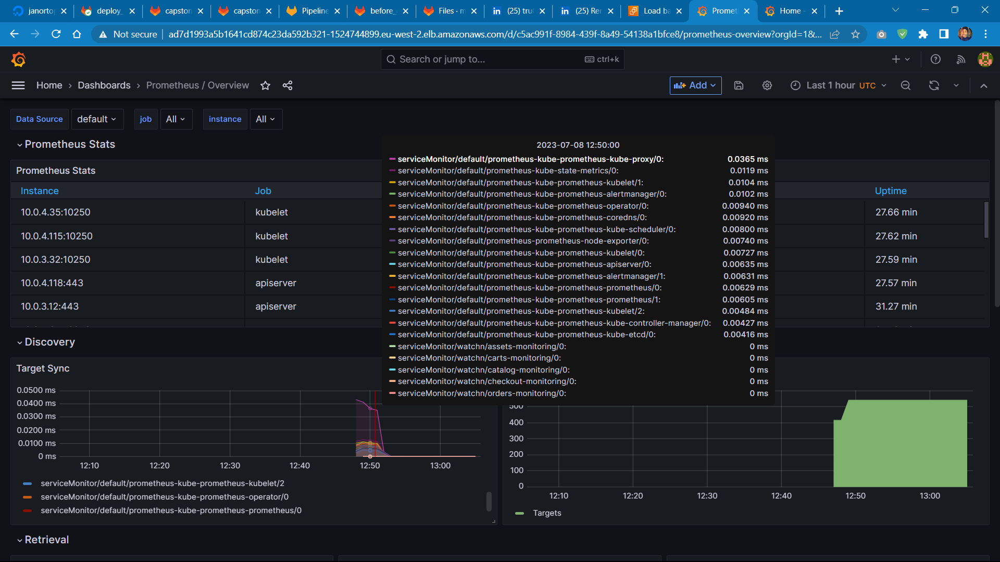

# Capstone Project - Deploy Watchn

### Watchn Application
Link to Application repo: https://github.com/niallthomson/microservices-demo

### prerequisites for project
- aws account
- iam user with administrator access
- domain
- dockerhub account
- gitlab account

### prerequisites for pipeline
- remote backend for terraform state — a sample file to create s3 backend available in ./capstone-deploy/terraform/remote.tf
- namedotcom token
- create the following variables in gitlab:
```
AWS_ACCESS_KEY_ID   [variable.type: env_var]
AWS_CREDENTIALS     [variable.type: env_var]
AWS_DEFAULT_REGION  [variable.type: env_var]
REGISTRY_PASS       [variable.type: env_var]
REGISTRY_USER       [variable.type: env_var]
```


## Breakdown
#### stage: infrastructure
- uses **'ubuntu:focal'** image as base image
- installs the necessary dependencies and binary/executable files (terraform, aws-cli, helm) to connect to aws and run terraform configuration
- takes in the following variables in the 'before_script': **AWS_ACCESS_KEY_ID, AWS_SECRET_ACCESS_KEY, AWS_DEFAULT_REGION**
- script argument runs terraform configuration
- creates **artifacts**
#### stage: test
- uses **'docker:23.0.1-cli'** image and it's **'docker:23.0.1-dind'** service 
- takes in variable: **DOCKER_TLS_CERTDIR: "/certs"**
- has a before_script argument to install bash
- 'script' runs the test script
#### stage: build
- uses **'docker:23.0.1-cli'** image and it's **'docker:23.0.1-dind'** service 
- takes in variable: **DOCKER_TLS_CERTDIR: "/certs"**
- has a 'before_script' to login to dockerhub
- has 'script' that builds and pushes images to dockerhub
#### stage: deploy-to-staging
- uses **'dtzar/helm-kubectl:latest'** image to connect to cluster and use helm
- has **'if: $CI_COMMIT_REF_NAME != $CI_DEFAULT_BRANCH'** rule which makes 'deploy-to-staging' job to only run from staging branch
- has a 'before_script' which installs **aws-iam-authenticator, helmfile and helm-diff plugin** on job container
- has 'script' which deploys to staging environment
#### stage: deploy-to-producuction
- uses **'dtzar/helm-kubectl:latest'** image to connect to cluster and use helm
- has **'if: $CI_COMMIT_REF_NAME == $CI_DEFAULT_BRANCH'** rule which makes 'deploy-to-producuction' job to only run from master branch
- has a 'before_script' which installs aws-iam-authenticator, helmfile and helm-diff plugin on job container
- has 'script' which deploys to production environment
## What pipeline does
#### stage 'infrastructure':
- contains the **infrastructure job**
- **deploys** and **sets up cluster** with terraform
- creates **artifacts** for **credentials** to **connect** to cluster in later jobs
- contains the **get_cluster_credentials job** which is to only get the **cluster credentials** from terraform **after cluster** has been **created** 


#### stage 'test':
- contains the **"run_tests"** job
- it **builds** the **images** for the source codes **and tests** the **application** before the build stage (the tests provided by the developers for the application failed, hence why it was skipped in the pipeline)


#### stage 'build':
- contains the **"build_images"** job
- **builds** the **images** for the **various microservices** (ui, catalog, carts, orders, checkout, assets, activemq) and pushes to dockerhub account


#### stage 'deploy-to-staging':
- contains the **"deploy-to-staging" job**
- deploys **watchn, prometheus** and **loki to staging** environment cluster before production


#### stage 'deploy-to-production':
- contains the **"deploy-to-producuction"** job
- deploys **watchn, prometheus** and **loki to production**


#### Pipeline Architecture Diagram


## Infrastructure
#### ./capstone-deploy/terraform
- creates **2 eks cluster** and **2 eks node group,** one for **staging** and one for **production,** in private subnets with only 443 ingress rule
- sets **remote backend** as s3 bucket
- creates **hosted zone**
- creates **nginx-ingress-controller** for both kubernetes clusters and calls it's Load Balancer data back into configuration to attach to a **wildcard hosted zone record**
- adds hosted zone **nameservers** to namedotcom domain using terraform **namedotcom provider**
#### Infrastructure Architecture Diagram

## configuration
#### ./deploy/kubernetes
- deploys **watchn** application using **helmfile, helm charts** and **helm-diff plugin**
#### ./capstone-deploy/kubernetes
- **'./ingress/loki-ingress.yml'** - ingress configuration for loki (logging)
- **'./ingress/prometheus-grafana-ingress.yml'** - ingress configuration for prometheus grafana ui
- **'./monitoring/assets-service-monitor.yml'** - service monitor configuration for assets microservices, prometheus now able to see and scrape metrics
- **'./monitoring/carts-service-monitor.yml'** - service monitor configuration for carts microservices, prometheus now able 
- **'./monitoring/catalog-service-monitor.yml'** - service monitor configuration for catalog microservices, prometheus now able 
- **'./monitoring/checkout-service-monitor.yml'** - service monitor configuration for checkout microservices, prometheus now able 
- **'./monitoring/orders-service-monitor.yml'** - service monitor configuration for orders microservices, prometheus now able
- **'./monitoring/ui-service-monitor.yml'** - service monitor configuration for ui microservices, prometheus now able
prometheus-grafana-service.yml - 
- **'./monitoring/prometheus-service.yml'** - service configuration for prometheus deployment
- **'./monitoring/prometheus-grafana-service.yml'** - Load Balancer service configuration for prometheus grafana ui service
- **'deploy.sh'** - script to deploy all the configurations on both staging and production clusters
- **'ui-service.yml'** - Load Balancer service configuration for watchn ui service
- **'./ingress/ui-ingress.yml'**- ingress configuration for watchn ui 
- **'install-vpa.sh'** - script to install Vertical Pod Autoscaler (VPA) on cluster
- **'vpa-auto-mode.yml'** - configuration to set 'updateMode: auto' for VPA
## Steps to recreate
- get a **namedotcom** domain and create an api token
- get an **aws account** and create an **IAM user **with **enough permissions** preferable administratoraccess
- get a **dockerhub account** with its **username** and **password** as **"REGISTRY_USER"** and **"REGISTRY_PASS"** variables respectfully created in **Settings > CICD > Variables** 
- isolate **'./capstone-deploy/terraform/remote.tf'** along with **'./capstone-deploy/terraform/providers.tf'** and **'./capstone-deploy/terraform/variables.tf'** from the rest of the terraform configuration
- create a remote backend using the **'./capstone-deploy/terraform/remote.tf'** configuration (delete the terraform state after if the separated terraform configurations are returned to the same directory)
- import repo to gitlab as a **CICD project**
- create all the variables listed above in "prerequisites for pipeline" section
- replace the **domain name,** and **namedotcom username** and **token** in the **"./capstone-deploy/terraform/variables.tf"** file
- run pipeline
## Security
- hid sensitive keys and credentials using gitlab variables
- set dev branch pipeline to deploy only to staging environment
- merge request from dev branch to master branch needs approval from project owner
- pipeline to production only runs from master branch
- set appropriate permissions for the different users according to their role
- clusters in private subnets with only 443 ingress rule
## Autoscaling
- making use of **Vertical Pod Autoscaler (VPA)** to scale kubernetes cluster according to historical resource usage measurements
- Adds more CPU and Memory to pods by adjusting the resource requests and limits for pods
## Watchn app ui

## prometheus monitoring and metrics



## loki logging


